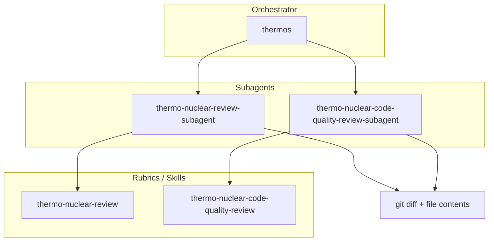

# Agent Thermos


Platform-agnostic Thermos packages for Codex, Claude Code, and Pi. Thermos runs
two deliberately different review passes on the same branch: one focused on
correctness, security, breakages, devex regressions, and feature-gate leaks; the
other focused on strict code quality, maintainability, structure, abstraction
boundaries, and "code-judo" simplification opportunities.

This project is inspired by Cursor's original MIT-licensed
[Thermos plugin](https://github.com/cursor/plugins/tree/main/thermos). The
architecture, methodology, and examples below intentionally preserve the value
proposition of the upstream plugin while adapting it to multiple agent hosts.

## Packages

| Package | Host | Primary invocation |
|:--|:--|:--|
| `@thinkscape/codex-thermos` | OpenAI Codex | `$thermos` |
| `@thinkscape/claude-thermos` | Claude Code | `/thermos:run` or optional `/thermos` shim |
| `@thinkscape/pi-thermos` | Pi | provider-specific subagent orchestration |
| `@thinkscape/thermos-core` | internal | shared prompts, rubrics, templates, and docs |

## Architecture



## Methodology

Thermos works best as a double review:

1. Determine the review scope from a base ref, PR, current branch, or explicit file scope.
2. Gather `git diff <base>...HEAD` and enough changed-file context for reviewers to verify findings.
3. Run both review passes on the same input.
4. Ask each reviewer for prioritized findings with file references and evidence.
5. Synthesize the results, dedupe overlapping issues, and lead with findings.

The deep review pass is strict about correctness and security. It only reports
issues introduced or modified by the branch and is expected to trace related
client/server or cross-package behavior before making a claim.

The code-quality pass is intentionally demanding. It looks for structural
regressions, spaghetti growth, files pushed past healthy size boundaries,
unnecessary wrappers, cast-heavy contracts, and missed opportunities to make the
implementation dramatically simpler.

## Development

```bash
bun install
bun run test:ci
```

Useful scripts:

| Script | Purpose |
|:--|:--|
| `bun run test` | Run all tests. |
| `bun run test:ci` | Run lint, typecheck, generated-file checks, tests, and package checks. |
| `bun run changeset` | Create a changeset. |
| `bun run version` | Apply changeset versions and changelogs. |
| `bun run release` | Validate and publish packages through Changesets. |

## Release Automation

Pull requests and pushes to `main` run the Bun CI workflow. Merges to `main`
also run Changesets release automation. When changesets exist, the release
workflow opens or updates a version PR. When the version PR lands, it publishes
the public packages to npm using `NPM_TOKEN`.

## Attribution

This repository adapts documentation, methodology, and prompt structure from
Cursor's Thermos plugin, which is distributed under the MIT License. See
[NOTICE.md](./NOTICE.md) for the upstream copyright notice.

## License

MIT
