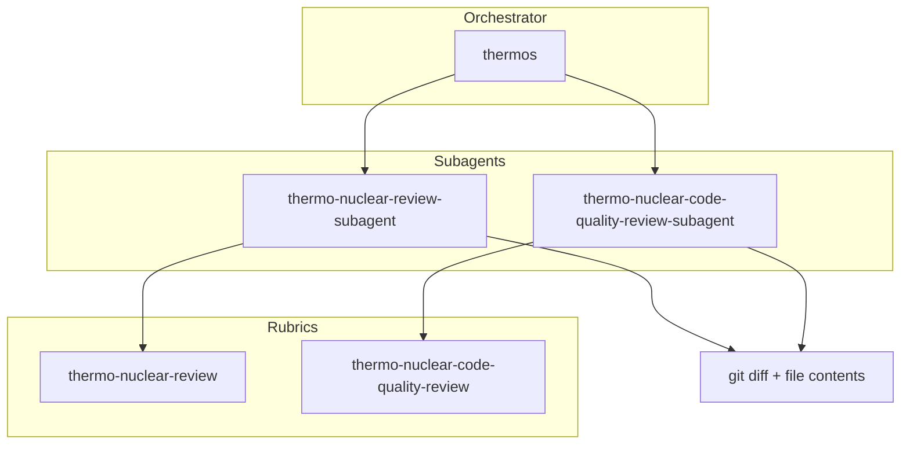

# @thinkscape/claude-thermos


Thermo-nuclear branch review for Claude Code: deep correctness and security
audits, strict maintainability rubrics, and parallel subagent orchestration.

Adapted from Cursor's MIT-licensed
[Thermos plugin](https://github.com/cursor/plugins/tree/main/thermos).

## Installation

Install or link the package, then load the plugin root with Claude Code:

```bash
claude --plugin-dir ./packages/claude-thermos
```

The npm package is named `@thinkscape/claude-thermos`, but the Claude plugin
manifest is named `thermos`. That keeps plugin commands short.

## Primary invocation

```text
/thermos:run [base-ref | PR URL | scope]
```

For an unprefixed command, install the optional standalone shim:

```bash
claude-thermos install-command --scope project
```

Then use:

```text
/thermos [base-ref | PR URL | scope]
```

## Architecture



## Agents

| Agent | Description |
|:------|:------------|
| `thermos:thermo-nuclear-review-subagent` | Deep diff-scoped review for correctness, security, devex, and feature-gate risk. |
| `thermos:thermo-nuclear-code-quality-review-subagent` | Strict code-quality review for structure, code-judo, 1k-line rule, and boundaries. |

## Typical usage

```text
/thermos:run main
/thermos:run https://github.com/acme/app/pull/123
/thermos:run review the API changes only
```

Thermos gathers diff context, launches both agents with the same input, and
synthesizes prioritized findings. Use the optional `/thermos` shim if you prefer
the shorter local command.

## Attribution

This package adapts methodology, diagrams, and prompt structure from Cursor's
Thermos plugin. See the repository `NOTICE.md` for the upstream MIT notice.
