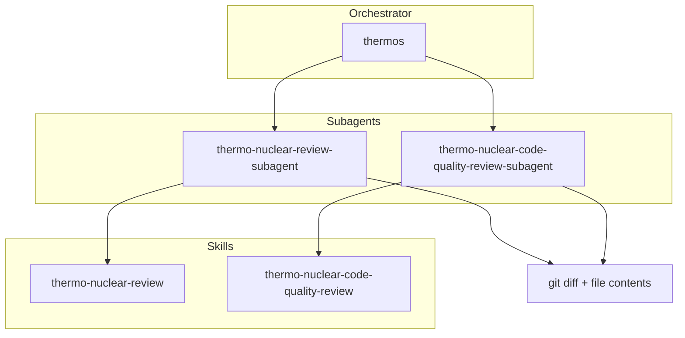

# @thinkscape/codex-thermos


Thermo-nuclear branch review for Codex: deep correctness and security audits,
strict maintainability rubrics, and subagent orchestration.

Adapted from Cursor's MIT-licensed
[Thermos plugin](https://github.com/cursor/plugins/tree/main/thermos).

## Installation

This package is a Codex plugin whose plugin id is `thermos` and display name is
**Thermos**. Add the repository marketplace, install the plugin, then start a new
thread:

```bash
codex plugin marketplace add ./path/to/agent-thermos
```

The repo marketplace entry lives at `.agents/plugins/marketplace.json`.

## Primary invocation

```text
$thermos
```

Pass a base ref, PR URL, or scope when useful:

```text
$thermos main
$thermos https://github.com/acme/app/pull/123
$thermos review packages/api only
```

## Architecture



## Skills

| Skill | Description |
|:------|:------------|
| `thermo-nuclear-review` | Deep branch audit for bugs, breakages, security, devex, and feature-gate leaks. |
| `thermo-nuclear-code-quality-review` | Strict maintainability audit for code-judo, 1k-line rule, spaghetti, and boundaries. |
| `thermos` | Run both review passes and synthesize findings. |

## Typical usage

1. Gather `git diff main...HEAD` and relevant changed-file contents.
2. Run both Thermos review passes on the same context.
3. Synthesize prioritized, deduped findings.

If the current Codex surface has subagent support, `$thermos` should run the two
review passes in parallel. If not, it should run them sequentially and keep the
outputs separated before synthesis.

## Attribution

This package adapts methodology, diagrams, and prompt structure from Cursor's
Thermos plugin. See the repository `NOTICE.md` for the upstream MIT notice.
