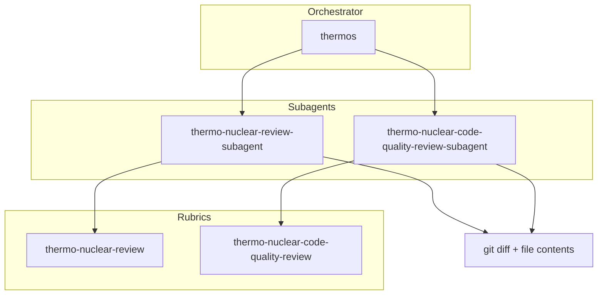

# @thinkscape/pi-thermos


Thermo-nuclear branch review for Pi: deep correctness and security audits,
strict maintainability rubrics, and provider-aware subagent orchestration.

Adapted from Cursor's MIT-licensed
[Thermos plugin](https://github.com/cursor/plugins/tree/main/thermos).

## Installation

```bash
pi install npm:@thinkscape/pi-thermos
```

Thermos supports these Pi subagent packages:

| Provider | Package | Tool shape |
|:--|:--|:--|
| Nico | `pi-subagents` | `subagent({ tasks, chain, ... })` |
| Gotgenes | `@gotgenes/pi-subagents` | `subagent({ subagent_type, prompt, run_in_background })` |
| Tintinweb | `@tintinweb/pi-subagents` | `Agent({ subagent_type, prompt, run_in_background })` |

## Install agent definitions

```bash
pi-thermos install-agents --scope project --provider auto
```

`auto` installs Nico-compatible definitions by default because Nico's package has
the broadest project/user agent frontmatter. You can select a provider explicitly:

```bash
pi-thermos install-agents --scope project --provider gotgenes
pi-thermos install-agents --scope user --provider tintinweb
```

## Architecture



## Methodology

Thermos separates two review questions:

- Will this branch break functionality, security, devex, or feature gates?
- Did this branch make the codebase structurally worse?

The Pi package detects the available subagent provider and builds the right
payload for that provider. Integration tests use dry-run payload generation and
do not require API keys or a running Pi session.

## Attribution

This package adapts methodology, diagrams, and prompt structure from Cursor's
Thermos plugin. See the repository `NOTICE.md` for the upstream MIT notice.
